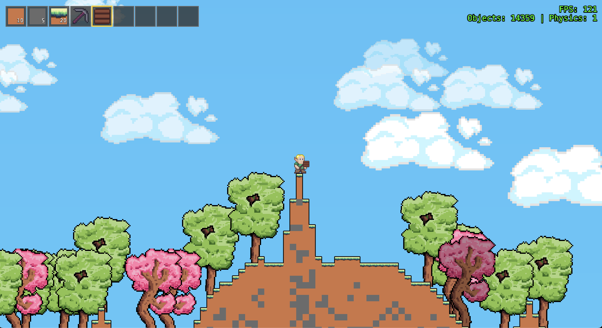

# Elowen

A 2D mining and building game built with Phaser 3 and TypeScript. Mine blocks, build structures, and explore a procedurally generated world.




## 🎮 Play Now

**[Play Elowen →](https://elowen-pi.vercel.app/)**

Try the game in your browser! No installation required.

## ⚠️ Project Status

**This project is currently in active development.** Many features are still being implemented and refined.

### Planned Features
- 🧱 More block types and variants
- 🔊 Additional sound effects and background music
- 🎨 Enhanced background and visual effects
- 🌍 Improved procedural terrain generation
- ⚡ Performance optimizations (culling, chunk loading, etc.)
- 🎮 Additional gameplay mechanics

## 🎮 Features

### Current Features
- **Mining System**: Mine dirt, grass, and stone blocks with a pickaxe
- **Block Placement**: Place blocks from your inventory to build structures
- **Player Movement**: Smooth 2D platformer controls with jumping and running
- **Inventory System**: 9-slot hotbar for managing your blocks
- **Terrain Generation**: Procedurally generated terrain with varying heights
- **Trees**: Decorative trees scattered across the landscape
- **Sound Effects**: Audio feedback for mining, jumping, and movement
- **Camera System**: Smooth camera following with zoom controls
- **Block Variants**: Visual variants based on neighboring blocks (slopes, surfaces)
- **Damage System**: Blocks show visual damage as they're mined

## 🚀 Getting Started

### Prerequisites
- Node.js (v18 or higher recommended)
- npm or yarn

### Installation

1. Clone the repository:
```bash
git clone https://github.com/abacchi00/elowen.git
cd elowen
```

2. Install dependencies:
```bash
npm install
```

3. Start the development server:
```bash
npm run dev
```

4. Open your browser and navigate to `http://localhost:3000` (or the port shown in the terminal)

### Building for Production

```bash
npm run build
```

The built files will be in the `dist/` directory.

## 🎯 Controls

- **Arrow Keys** or **WASD**: Move player left/right
- **Up Arrow** or **W** or **Space**: Jump
- **Left Click**: Mine blocks (when hovering over them)
- **Right Click**: Place blocks from inventory
- **Mouse Wheel**: Select items in hotbar
- **Mouse Wheel + Shift**: Zoom in/out

## 🛠️ Tech Stack

- **Phaser 3**: Game framework
- **TypeScript**: Type-safe JavaScript
- **Vite**: Build tool and dev server
- **ESLint**: Code linting
- **Prettier**: Code formatting

## 🧪 Development

### Available Scripts

- `npm run dev` - Start development server
- `npm run build` - Build for production
- `npm run preview` - Preview production build
- `npm run typecheck` - Run TypeScript type checking
- `npm run lint` - Run ESLint
- `npm run format` - Format code with Prettier
- `npm run format:check` - Check code formatting

## 📝 License

This project is open source and available under the [MIT License](LICENSE).

## 🙏 Acknowledgments

- Built with [Phaser 3](https://phaser.io/)
- Powered by [Vite](https://vitejs.dev/)

---

**Note**: This is a work in progress. Features may change, and there may be bugs. Feel free to report issues or suggest improvements!
